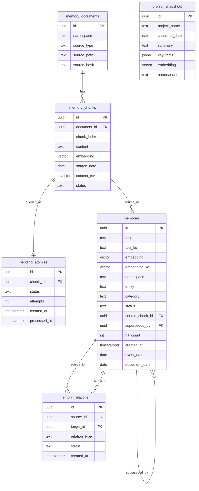

# Memory V2/V3 Architecture

## 1. Purpose and Scope

This service is the memory sidecar behind OpenClaw `memory_search` replacement.

It combines:
- V2 chunk retrieval (document-level ingest + vector/BM25 hybrid)
- V3 atomic memory layer (fact-level memory + relation graph + snapshots)
- Async extraction workers (Tier 1 rule-based, Tier 2 LLM-based)

Primary endpoint:
- `POST /v1/memory/search` on `127.0.0.1:18790`

Code root:
- `services/memory-v2`

## 2. Runtime Components

### 2.1 API server (`server.py`)
- Hosts FastAPI endpoints for search, ingest/flush, stats, queue, atomize, snapshots, relink.
- Starts a background hit flush thread at startup.

### 2.2 Ingest pipeline (`ingest.py`, `session_ingest.py`)
- Ingests markdown memory files and active session JSONL streams into:
  - `memory_documents`
  - `memory_chunks`
- Enqueues new chunks into `pending_atomize` for V3 extraction.

### 2.3 Tier 1 atomizer worker (`atomize_worker.py`, `atomizer.py`)
- Polls `pending_atomize` queue.
- Extracts deterministic facts from chunk text.
- Embeds and inserts into `memories`.
- Runs dedup and relation linking.

### 2.4 Tier 2 LLM worker (`llm_atomize_worker.py`, `llm_atomizer.py`)
- Selectively re-processes chunks with Gemini 2.5 Flash.
- Adds higher-quality conversational/transaction facts.
- Tracks processed chunks in `llm_atomize_runs`.

### 2.5 Search pipeline (`search_engine.py`)
- V3 memory-first search:
  1. snapshot search
  2. memory vector search
  3. fallback to V2 chunk hybrid search if needed
- Applies decay, hit boost, category boost, and intent-aware fallback.

### 2.6 Snapshot generator (`snapshot_generator.py`)
- Builds entity-level current-state summaries from active memories.
- Writes to `project_snapshots` with vector embeddings.

### 2.7 DB access layer (`db.py`)
- `psycopg2` threaded pool.
- CRUD/search for chunks, memories, queue, relations.

### 2.8 Embeddings (`embeddings.py`)
- Uses local Ollama endpoint (`/api/embed`) with `bge-m3:latest` (1024-dim).

## 3. End-to-End Data Flow

### 3.1 File/session ingest flow
1. Read source files/session lines.
2. Chunk text (`chunk_markdown` or session chunking).
3. Embed chunk content.
4. Upsert `memory_documents`, insert `memory_chunks`.
5. Enqueue chunk IDs into `pending_atomize` (except selected curated core files).

### 3.2 Atomic memory extraction flow
1. Worker claims `pending_atomize` rows (`FOR UPDATE SKIP LOCKED` pattern).
2. Extracts fact candidates (Tier 1 or Tier 2).
3. Embeds `fact` (+ optional `fact_ko`).
4. Deduplicates (intra-batch + DB cosine threshold).
5. Inserts rows into `memories`.
6. Links relations (`updates`/`extends`/`contradicts`) and supersedes old rows when needed.
7. Marks queue item done/failed with retry accounting.

### 3.3 Query/search flow (`/v1/memory/search`)
1. Expand query with alias/cross-lingual terms.
2. Embed query once.
3. Run snapshot search (current intent only).
4. Run memory vector search (dual embedding pass: `embedding`, `embedding_ko`).
5. Score memory results with decay/hit/category modifiers.
6. If insufficient high-quality memory hits, run V2 chunk hybrid fallback (vector + BM25 + RRF).
7. Merge, dedup by chunk, sort by score, return top N.
8. Buffer memory hit counts and flush asynchronously.

## 4. Data Model and Relations

Note: `memory_documents` and `memory_chunks` predate the V3 migration and are used by V2 chunk search + ingest.

V3 schema migrations add:
- `memories`
- `memory_relations`
- `pending_atomize`
- `project_snapshots`
- later columns: `hit_count`, `last_hit_at`, `fact_ko`, `embedding_ko`

## 5. Ranking and Scoring Strategy

### 5.1 V2 chunk hybrid
- Vector cosine search over `memory_chunks.embedding`.
- BM25 lexical search over `memory_chunks.content_tsv`.
- RRF fusion + rerank with:
  - semantic score
  - lexical score
  - recency decay
  - status prior
  - source-type gate
- Intent-aware thresholding (`current` vs `postmortem`).

### 5.2 V3 memory-first
- Candidate search from `memories` with dual vector passes:
  - English embedding (`embedding`)
  - Korean embedding (`embedding_ko`)
- Merge by memory id, max similarity.
- Final score includes:
  - cosine similarity
  - age decay (`MEMORY_HALFLIFE`)
  - hit_count boost
  - category boost by query pattern
- Fallback to V2 chunks when high-confidence memory hits are insufficient.

## 6. Operational Model

Typical long-running processes:
- API server (`server.py`, uvicorn)
- Tier 1 worker (`atomize_worker.py`)
- Tier 2 worker (`llm_atomize_worker.py`)
- periodic ingest trigger (`/v1/memory/flush` caller)
- periodic snapshot generation trigger (CLI or endpoint)

Key endpoints:
- `GET /health`
- `POST /v1/memory/search`
- `POST /v1/memory/ingest`
- `POST /v1/memory/flush`
- `GET /v1/memory/stats`
- `GET /v1/memory/queue/status`
- `POST /v1/memory/atomize`
- `POST /v1/memory/relink`, `GET /v1/memory/relink/{job_id}`
- `POST /v1/memory/snapshots/generate`

## 7. Failure and Degradation Behavior

- If V3 memory tables/search fail, search pipeline degrades to V2 chunk search.
- Queue enqueue failures during ingest are non-fatal (logged, ingest continues).
- Tier 2 failures are isolated per batch/chunk and tracked via `llm_atomize_runs`.
- Hit updates use in-memory buffer + periodic flush; DB failure does not block query path.

## 8. Design Constraints and Tradeoffs

- Embedding provider is local Ollama for low-latency/no external dependency on core path.
- V3 facts improve precision and temporal continuity, but require async workers and queue ops.
- Relation linking is deterministic (no LLM) for predictable cost/behavior.
- Snapshot generation is rule-based and cheap, but less expressive than LLM summaries.

## 9. Source of Truth by Layer

- Chunk truth (raw retrieval): `memory_chunks`
- Atomic fact truth: `memories` (`status='active'` considered current)
- Change history/audit edges: `memory_relations`
- Current entity synopsis: `project_snapshots`
- Pending extraction work: `pending_atomize`

